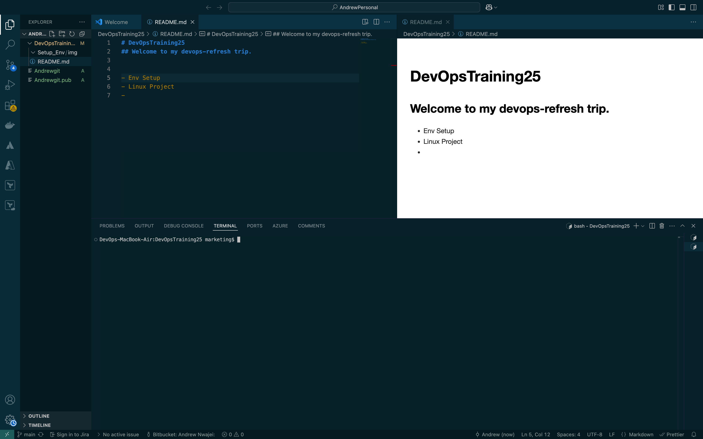
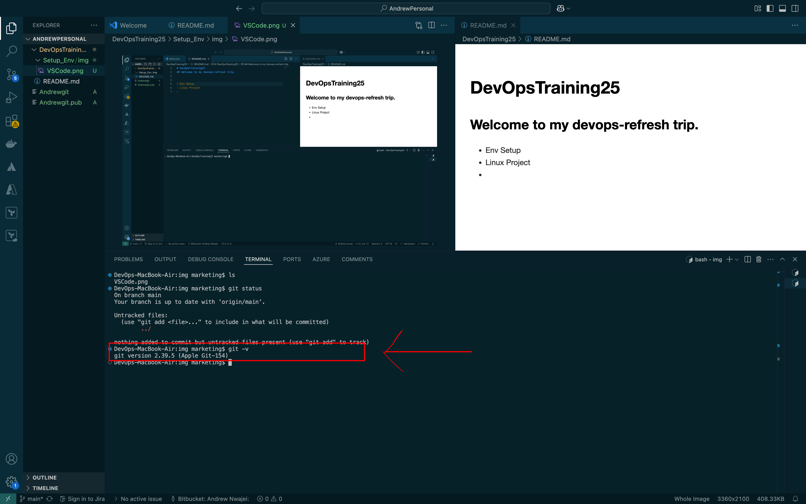
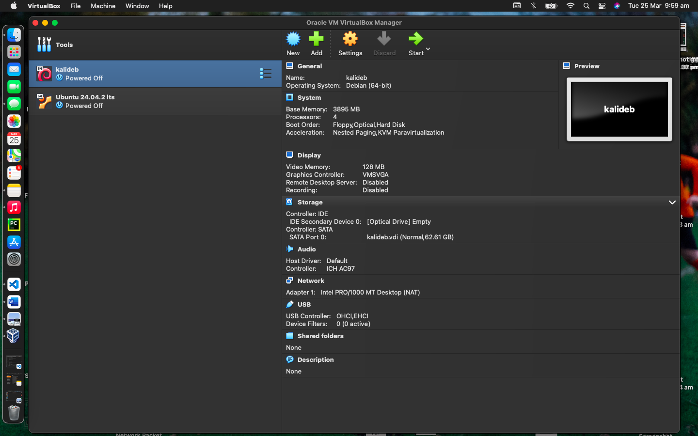
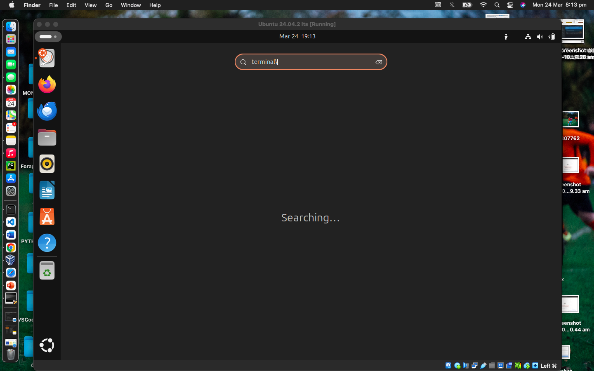

# Environment Setup 
In this project we would be displaying our devops lab setup with the necessary requirements.

## VSCode
We will be using the IDE throughout our journey. 

## Git
Git version to show that git is installed on the machine.

## Virtual Box
To install linux distro - currently have kali and ubuntu but I am more comfortable with kali (which I will be making use of for the rest of the projects).

## Ubuntu on Virtual Box
Ubuntu distro started on VB.

## GitHub Account
Github account used to document my progress and collaborate with other engineers.

## AWS 
AWS account used for cloud exercises.

